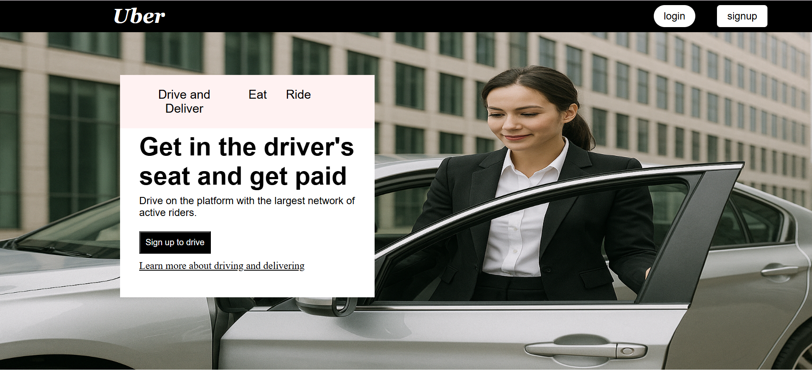

# 🚗 Uber Landing Page UI Clone

A clean and responsive clone of Uber’s landing page built using **HTML and CSS**. This project is a pixel-perfect recreation of Uber’s homepage, designed to strengthen frontend layout and styling skills.

---

## 📸 Preview

---

## 🌟 Features

- 🧭 Top navigation bar with login/signup buttons
- 🚘 Prominent CTA section for drivers
- 🖼️ Background image with overlaid content
- ✨ Tabs (Drive & Deliver | Eat | Ride) for layout flexibility

---

## 🛠️ Built With

- **HTML5**
- **CSS3**

---

## 💼 What I Learned

- Positioning elements over images
- Styling buttons and nav menus
- Font and layout matching to real-world sites
- Importance of whitespace and minimalism in UI

---

## 🚀 How to Run Locally

   bash

1. Clone the repo:
   git clone https://github.com/vinaya2007/Uber-Clone.git

2. Navigate to the project folder:
   cd Uber-Clone

3. Open `index.html` in your browser.

## 📬 Contact
📧 vinayavinodh07@gmail.com
📞 +91 90032 80933

## Credits

Built by Vinaya V
